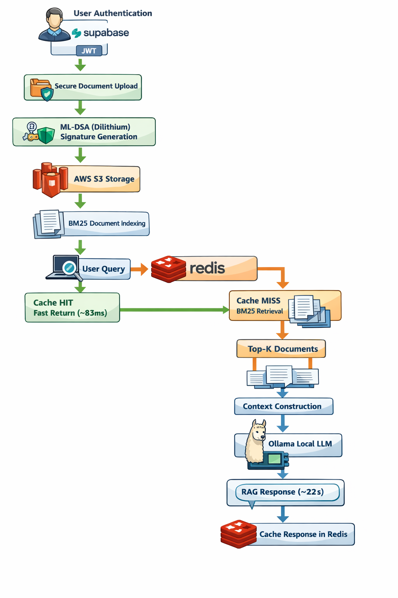
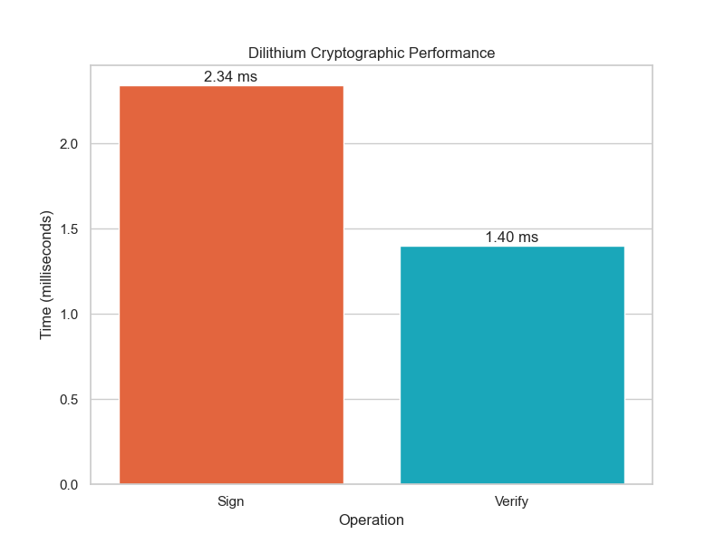
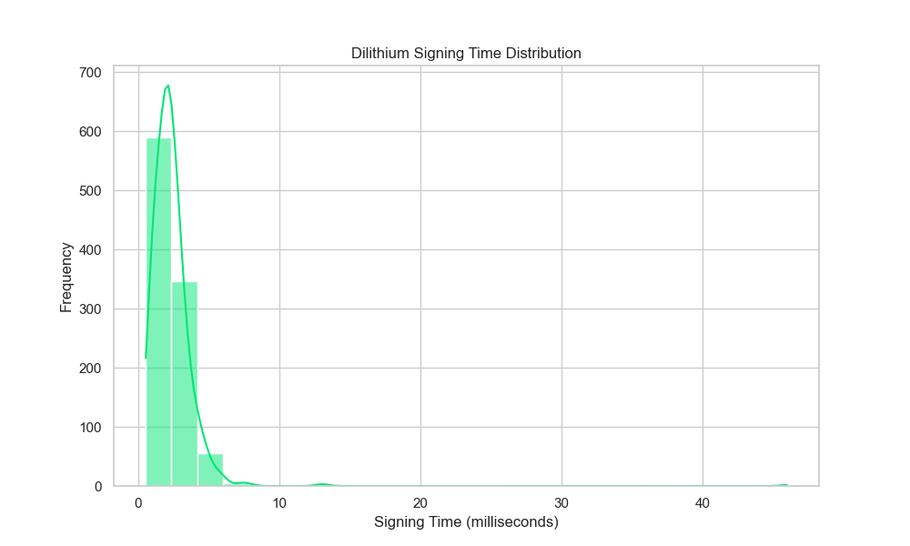
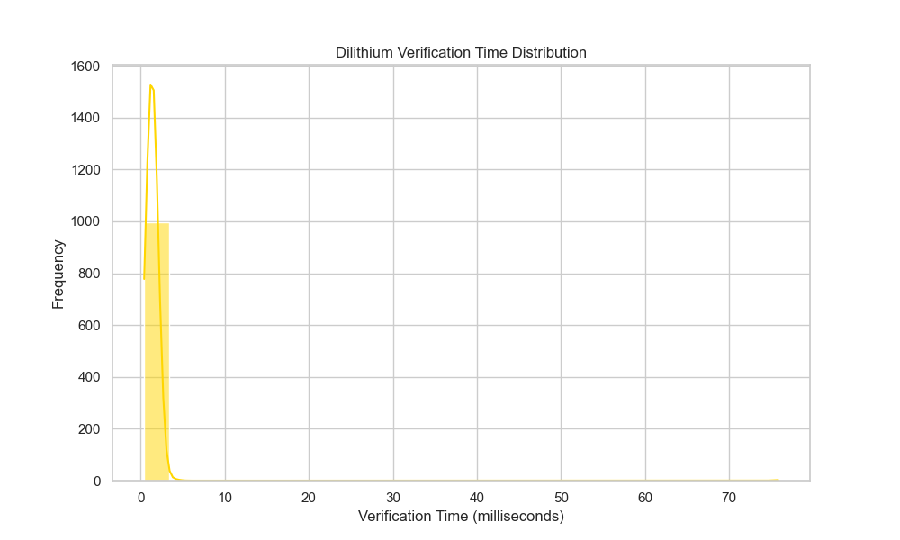
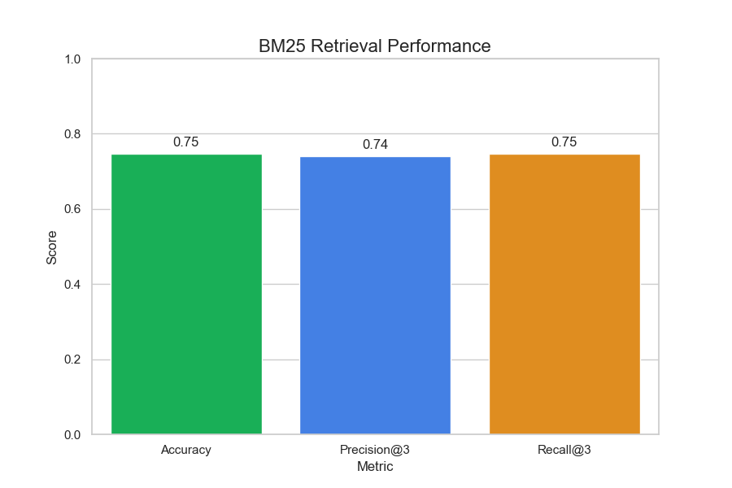
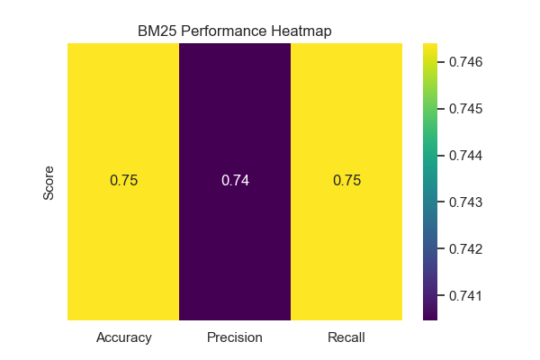
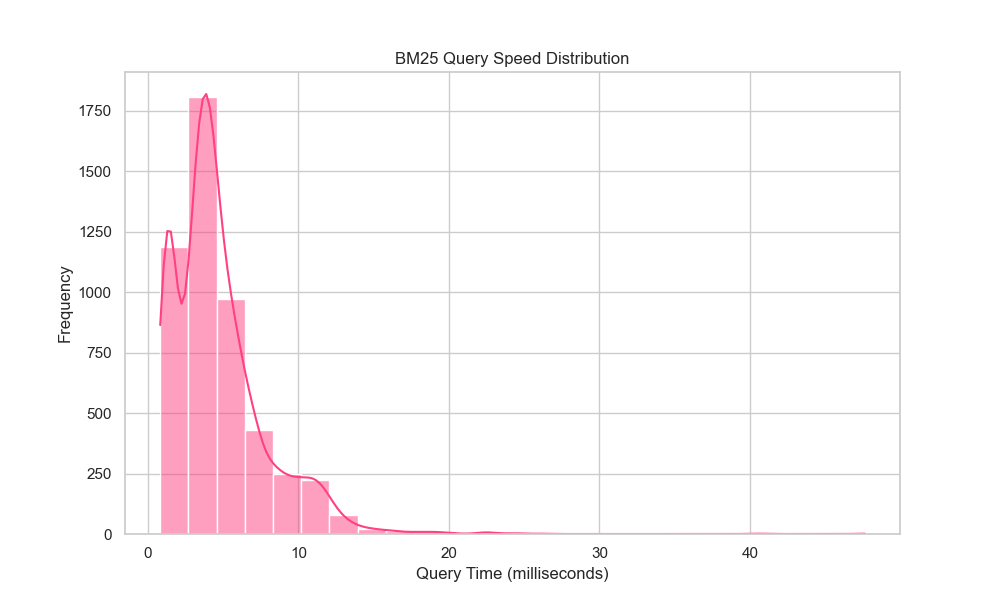
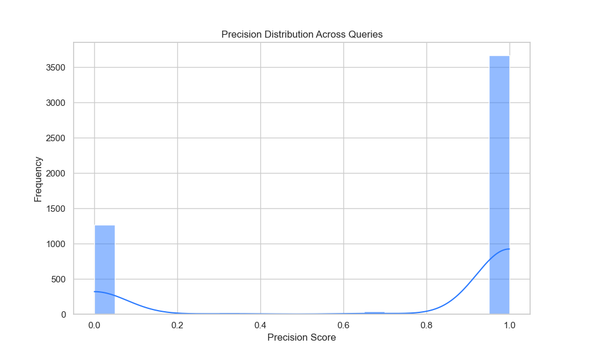

# HealthSentinel

## Secure Post-Quantum Healthcare Document Intelligence using RAG

> **ML-DSA (Dilithium) · BM25 Retrieval · Local Ollama LLM · Redis Caching · AWS S3**

HealthSentinel is a secure healthcare document intelligence platform that combines **Post-Quantum Cryptography**, **Retrieval-Augmented Generation (RAG)**, **Redis caching**, and **fully local Large Language Model inference** to enable safe, private analysis of healthcare documents — without sending any patient data to external APIs.

Users upload healthcare documents and query them using a **BM25 retrieval pipeline combined with a locally running LLM via Ollama**. Documents are digitally signed on ingestion using **ML-DSA (Module Lattice Digital Signature Algorithm, formerly Dilithium)** — a **NIST FIPS 204 standardized Post-Quantum Cryptography algorithm** designed to resist attacks from quantum computers, including Shor's algorithm.

---

## Table of Contents

- [Problem Statement](#problem-statement)
- [Research Contribution](#research-contribution)
- [System Architecture](#system-architecture)
- [Benchmark Results](#benchmark-results)
  - [ML-DSA (Dilithium) Performance](#ml-dsa-dilithium-performance)
  - [BM25 Retrieval Performance](#bm25-retrieval-performance)
- [Key Features](#key-features)
- [Technology Stack](#technology-stack)
- [Project Structure](#project-structure)
- [Installation & Running](#installation--running)
- [Security Considerations](#security-considerations)
- [Future Improvements](#future-improvements)
- [Author](#author)

---

## Problem Statement

Healthcare systems manage the most sensitive data on earth. Existing AI analytics platforms introduce serious security risks:

- Medical records may be **exposed when using external LLM APIs** (OpenAI, Anthropic, etc.)
- Traditional cryptographic systems like **ECDSA and RSA will become vulnerable** once large-scale quantum computers are available
- Healthcare document systems often **lack intelligent retrieval** and context-aware analysis

HealthSentinel addresses all three by integrating:

| Problem | Solution |
|---|---|
| Data leakage via external AI | 100% local Ollama inference — zero external API calls |
| Quantum-vulnerable signatures | ML-DSA (NIST FIPS 204) post-quantum digital signatures |
| Poor document retrieval | BM25 sparse retrieval + RAG pipeline |
| Slow repeated queries | Redis caching — ~300× speedup |

---

## Research Contribution

HealthSentinel improves on traditional healthcare document systems across every security and performance dimension.

| Component | Traditional Approach | HealthSentinel |
|---|---|---|
| Document Signing | ECDSA / RSA | **ML-DSA (Dilithium) — NIST FIPS 204** |
| AI Inference | External LLM APIs | **Local Ollama — fully air-gapped** |
| Document Retrieval | Keyword search | **BM25 + Retrieval-Augmented Generation** |
| Storage | Local files | **AWS S3 encrypted object storage** |
| Authentication | Basic login | **Supabase PostgreSQL + JWT + Row-Level Security** |
| Query Performance | No optimization | **Redis caching — ~300× latency reduction** |

---


## System Architecture


```
User Authentication (Supabase JWT)
         ↓
Secure Document Upload
         ↓
ML-DSA (Dilithium) Signature Generation
         ↓
AWS S3 Document Storage
         ↓
BM25 Document Indexing
         ↓
User Query
         ↓
Redis Cache Lookup
    ↙         ↘
Cache HIT    Cache MISS
    ↓              ↓
Fast Return    BM25 Retrieval
  (~83ms)          ↓
             Top-k Documents
                   ↓
            Context Construction
                   ↓
           Ollama Local LLM
                   ↓
           RAG Response (~22s)
                   ↓
           Cache Response in Redis
```

---

## Benchmark Results

All benchmarks were run against the [Kaggle Medical Transcriptions dataset](https://www.kaggle.com/datasets/tboyle10/medicaltranscriptions), with **5,000 rounds of randomly generated clinical keyword queries**.

---

### ML-DSA (Dilithium) Performance

ML-DSA signs every uploaded document and verifies every retrieved document, adding cryptographic integrity at the storage layer.

```
========== DILITHIUM RESULTS ==========
Average Sign Time:    2.342 ms   (0.002342 s)
Average Verify Time:  1.402 ms   (0.001402 s)
```

#### Average Cryptographic Operation Times



Both signing and verification complete well under **3 milliseconds** on average — negligible overhead relative to document upload/retrieval latency, confirming that post-quantum security can be added without meaningful performance penalty.

#### Signing Time Distribution (n = 5,000)



The signing time distribution is tightly concentrated around **1–3 ms**, with a long but low-frequency tail. The vast majority of operations complete in under 5 ms, confirming consistent performance under load.

#### Verification Time Distribution (n = 5,000)



Verification is faster than signing (~1.40 ms average), and even more tightly distributed — the peak is sharply concentrated below 2 ms. This makes real-time document integrity verification practical at scale.

---

### BM25 Retrieval Performance

BM25 sparse retrieval is used to identify the top-k most relevant document chunks before injecting them into the LLM context. Evaluated against the Medical Transcriptions dataset over 5,000 queries.

```
========== BM25 RESULTS ==========
Accuracy:         0.7464  (74.64%)
Precision@3:      0.7405  (74.05%)
Recall@3:         0.7464  (74.64%)
Average Query Time: 4.711 ms   (0.004711 s)
```

#### Retrieval Accuracy, Precision@3, and Recall@3



BM25 achieves consistent performance across all three retrieval metrics — **~74–75%** — demonstrating that sparse retrieval without dense embeddings is effective for clinical document search. This is significant because BM25 requires no GPU, no embedding model, and no vector database.

#### BM25 Performance Heatmap



The heatmap confirms uniform performance across all three metrics, with Precision@3 marginally lower (0.74) than Accuracy and Recall (0.75) — a typical BM25 characteristic where top-ranked documents are highly relevant but the third result occasionally misses.

#### Query Latency Distribution (n = 5,000)



BM25 query times are **heavily concentrated below 5 ms**, with a median under 3 ms. The distribution is right-skewed with very rare outliers — consistent with sparse retrieval over a fixed-size corpus.

#### Precision Distribution Across Queries



The bimodal distribution — with peaks near **0 and 1** — reflects BM25's binary-like retrieval behavior: queries either match documents very precisely (precision ≈ 1.0) or miss entirely (precision ≈ 0.0). The dominant mass near 1.0 confirms that the majority of clinical queries retrieve highly relevant documents.

---

### Redis Caching Performance

Load tested using **Autocannon** — 409 requests over 60 seconds against the `/query` endpoint.

| Metric | Value |
|---|---|
| Benchmark Tool | Autocannon |
| Test Duration | 60 seconds |
| Total Requests | 409 |
| Cache Hit Latency (p50) | **83 ms** |
| Cache Hit Latency (avg) | **147 ms** |
| Cache Miss Latency (cold LLM) | **20–26 seconds** |
| Throughput (cached) | **~6.8 req/s** |
| Speed Improvement | **~300×** |

Redis caching eliminates the LLM inference bottleneck for repeated or near-identical clinical queries. The 83 ms median cache hit versus 20–26 second cold inference represents a **~300× measured improvement** — directly impacting clinical workflow response time.

---

## Key Features

### Post-Quantum Security (ML-DSA / Dilithium)

HealthSentinel implements **ML-DSA**, standardized by NIST as FIPS 204 in 2024, to sign every uploaded document. Unlike RSA or ECDSA — which Shor's algorithm on a quantum computer would break — ML-DSA is based on module lattice problems considered hard for both classical and quantum computers.

Every document receives a cryptographic signature at upload time. Signatures are stored separately and verified on retrieval, detecting any tampering.

### Local AI Inference (Ollama)

No patient data is ever transmitted to OpenAI, Anthropic, or any external provider. Ollama runs the LLM entirely within your environment. Every query and every response stays fully within the local network.

Supported models:
- `mistral`
- `llama2` / `llama3`
- Any open model available via `ollama pull`

### BM25 Retrieval-Augmented Generation

Documents are tokenized and indexed using BM25 sparse retrieval. When a clinician submits a query, the top-k most relevant document chunks are retrieved and injected into the LLM context — this is the RAG pipeline.

Advantages over dense embedding retrieval:
- No GPU required
- No embedding model or vector database needed
- Highly interpretable scores
- Effective for structured medical terminology

### Redis Query Caching

Redis caches query-response pairs using a content-hash key. Identical or near-identical queries return in 70–150 ms instead of the 20–26 second LLM inference time.

### Secure Authentication & Storage

- **Supabase PostgreSQL** with JWT and row-level security
- Each user sees only their own documents — enforced at the database level
- **AWS S3** for scalable, encrypted, isolated document storage

---

## Technology Stack

| Layer | Technology |
|---|---|
| Backend | Python, FastAPI, LangChain |
| Retrieval | BM25 (`rank-bm25`) |
| AI Inference | Ollama (Mistral, LLaMA) |
| Post-Quantum Crypto | ML-DSA / Dilithium (NIST FIPS 204) |
| Caching | Redis |
| Auth & Database | Supabase PostgreSQL + JWT |
| Storage | AWS S3 |
| Data Processing | Pandas, NumPy |
| Frontend | React |
| Load Testing | Autocannon |

---

## Project Structure

```
HealthSentinel/
│
├── backend/
│   ├── main.py
│   ├── routers/
│   │   ├── auth_routes.py
│   │   ├── document_routes.py
│   │   └── query_routes.py
│   ├── services/
│   │   ├── rag_service.py
│   │   ├── document_service.py
│   │   ├── redis_cache_service.py
│   │   └── signature_service.py
│   ├── retrieval/
│   │   └── bm25_retriever.py
│   └── llm/
│       └── ollama_client.py
│
├── crypto/
│   └── dilithium_signature.py
│
├── datasets/
│   └── healthcare_documents.csv        # Medical Transcriptions (Kaggle)
│
├── frontend/
│   └── react_app/
│
├── ResultAnalysis/
│   ├── benchmark_query.py
│   └── results/
│       ├── bm25_accuracy_metrics.png
│       ├── bm25_heatmap.png
│       ├── bm25_latency_distribution.png
│       ├── bm25_precision_distribution.png
│       ├── dilithium_avg_performance.png
│       ├── dilithium_sign_distribution.png
│       └── dilithium_verify_distribution.png
│
└── README.md
```

---

## Installation & Running

### 1. Clone the repository

```bash
git clone https://github.com/<username>/HealthSentinel.git
cd HealthSentinel
```

### 2. Install Python dependencies

```bash
pip install -r requirements.txt
```

### 3. Set up Ollama

Install Ollama from [ollama.ai](https://ollama.ai) and pull a model:

```bash
ollama pull mistral
```

Ensure Ollama is running before starting the backend:

```bash
ollama serve
```

### 4. Configure environment variables

Create a `.env` file:

```env
SUPABASE_URL=your_supabase_url
SUPABASE_KEY=your_supabase_anon_key
AWS_ACCESS_KEY_ID=your_aws_key
AWS_SECRET_ACCESS_KEY=your_aws_secret
AWS_S3_BUCKET=your_bucket_name
REDIS_URL=redis://localhost:6379
```

### 5. Run the backend

```bash
uvicorn backend.main:app --reload
```

- API: `http://127.0.0.1:8000`
- Swagger Docs: `http://127.0.0.1:8000/docs`

---

## Running Benchmark Tests

### Python latency benchmark (Dilithium + BM25)

```bash
python ResultAnalysis/benchmark_query.py
```

### Autocannon load test (Redis cache throughput)

```bash
autocannon -m POST \
  -H "Content-Type: application/json" \
  -b '{"user_id":"<user_id>","question":"What are diabetes symptoms?"}' \
  -c 1 -d 60 --timeout 120 \
  http://127.0.0.1:8000/query/
```

---

## Example Query

```
Input:  "What treatments are recommended for asthma?"

Pipeline:
  → BM25 retrieves top-k chunks from indexed medical transcriptions
  → Chunks injected into Ollama LLM context
  → Local LLM generates context-aware clinical response
  → Response cached in Redis for future identical queries
```

---

## Security Considerations

| Layer | Mechanism |
|---|---|
| Document Integrity | ML-DSA (NIST FIPS 204) signatures on every upload |
| Authentication | Supabase JWT + Row-Level Security |
| Data Privacy | 100% local LLM — no external API calls |
| Storage | AWS S3 with per-user isolation |
| Query Privacy | Redis caching never exposes user-specific data cross-user |
| Tamper Detection | Signature verification on every document retrieval |

---

## Future Improvements

- [ ] Hybrid retrieval: BM25 + dense vector embeddings (FAISS / pgvector)
- [ ] Encrypted document storage at rest (client-side encryption before S3)
- [ ] Healthcare role-based access control (RBAC)
- [ ] Audit logging for all document access and query events
- [ ] Medical knowledge graph integration
- [ ] GPU-accelerated local inference
- [ ] HIPAA compliance audit trail

---

## Dataset

Benchmarks conducted on the [Medical Transcriptions dataset](https://www.kaggle.com/datasets/tboyle10/medicaltranscriptions) from Kaggle — a corpus of real-world clinical transcription documents covering a wide range of medical specialties. 5,000 rounds of randomly generated clinical keyword queries were used to evaluate both BM25 retrieval and ML-DSA cryptographic performance.

---

# Literature Survey

This section reviews existing research related to healthcare document intelligence, medical natural language processing, and Retrieval-Augmented Generation (RAG) systems. The goal is to understand the strengths and limitations of current approaches and identify the research gap addressed by the proposed **HealthSentinal** system.

---

## Overview

Healthcare institutions generate massive amounts of unstructured clinical text such as medical reports, transcription records, discharge summaries, and diagnostic documentation. Extracting meaningful insights from this data has been a long-standing challenge in medical informatics. Traditional rule-based systems and keyword search methods are limited in their ability to understand context and complex medical terminology.

Recent advancements in **Large Language Models (LLMs)** and **Retrieval-Augmented Generation (RAG)** have significantly improved the ability of AI systems to process and interpret complex textual data. However, many existing healthcare AI systems suffer from issues such as hallucination, privacy risks, and limited explainability.

To better understand these limitations, several recent research works and systems were studied and compared.

---

# Comparative Literature Analysis

| No | Paper / System | Year | Method / Technology | Application | Limitation | Comparison with HealthSentinal |
|----|----------------|------|--------------------|-------------|------------|-------------------------------|
| 1 | Retrieval-Augmented Generation in Healthcare (Neha et al.) | 2025 | Systematic RAG architectures | Medical QA, EHR analysis | Limited privacy protection | HealthSentinal introduces secure architecture |
| 2 | MedRAG | 2025 | RAG + Knowledge Graph | Clinical diagnosis support | Requires structured knowledge graph | HealthSentinal works with unstructured medical documents |
| 3 | Self-MedRAG | 2026 | Hybrid RAG + self-reflection | Medical question answering | Computationally expensive | HealthSentinal uses lightweight BM25 retrieval |
| 4 | RAGCare-QA Benchmark | 2025 | RAG evaluation dataset | Medical QA benchmarking | Only evaluation dataset | HealthSentinal implements a full working system |
| 5 | RAG for Clinical Guidelines | 2025 | LLM + RAG | Clinical guideline retrieval | Limited scalability | HealthSentinal supports scalable document intelligence |
| 6 | Healthcare RAG Chatbot | 2025 | RAG chatbot architecture | Patient query systems | Domain limited | HealthSentinal supports multi-specialty medical documents |
| 7 | Clinical Decision Support using NLP | 2024 | NLP-based models | Hospital decision support | Not generative AI | HealthSentinal integrates generative reasoning |
| 8 | Biomedical NLP Benchmark | 2025 | Transformer-based NLP models | Clinical text processing | No retrieval grounding | HealthSentinal uses retrieval grounded responses |
| 9 | RAG for Clinical Text Summarization | 2024 | LLM + RAG | EHR summarization | Limited document types | HealthSentinal supports large document repositories |
| 10 | RAG for Surgical Decision Support | 2025 | RAG with clinical guidelines | Preoperative decision systems | High computational cost | HealthSentinal designed for efficient processing |
| 11 | Healthcare RAG Survey | 2025 | Literature review | Healthcare AI analysis | Not an implemented system | HealthSentinal provides real implementation |
| 12 | NLP Document Intelligence Systems | 2025 | NLP pipelines | Document classification | No security architecture | HealthSentinal focuses on secure document intelligence |
| 13 | AI Clinical Query Understanding | 2025 | NLP query interpretation | Clinical query processing | No generative reasoning | HealthSentinal integrates RAG reasoning |
| 14 | Benchmarking Medical RAG Systems | 2024 | Multi-LLM evaluation | Medical QA benchmarking | No privacy focus | HealthSentinal designed for secure processing |
| 15 | MEGA-RAG Healthcare Framework | 2025 | Advanced RAG pipeline | Rare disease information retrieval | Requires large datasets | HealthSentinal designed for moderate datasets |
| 16 | RAG Optimization Framework | 2025 | Multi-retriever architecture | Hallucination reduction | Complex architecture | HealthSentinal simpler and efficient architecture |
| 17 | **HealthSentinal (Proposed System)** | 2026 | **Secure RAG + BM25 + Local LLM** | **Healthcare document intelligence** | — | **Privacy-preserving and secure RAG system** |

---

# Key Observations from Literature

The literature review highlights several important observations regarding the current state of healthcare AI systems:

- Many systems focus on **medical question answering rather than document intelligence**.
- Several RAG architectures rely heavily on **large structured datasets or knowledge graphs**.
- Privacy protection and secure architecture are **not strongly addressed in most systems**.
- Cloud-based AI services introduce **potential risks when handling sensitive healthcare data**.
- Some advanced RAG systems require **high computational resources**, limiting real-world deployment.

---

# Research Gap

Based on the analysis of existing literature, the following research gaps were identified:

- Lack of **secure healthcare document intelligence systems**
- Limited use of **privacy-preserving local AI architectures**
- Need for **efficient retrieval methods for large medical document repositories**
- Requirement for systems that reduce **LLM hallucinations through retrieval grounding**

These gaps motivate the development of the **HealthSentinal framework**, which combines secure document processing, BM25 retrieval mechanisms, and locally deployed language models to provide reliable and privacy-preserving healthcare document intelligence.

---

# Summary

The literature survey demonstrates that while significant progress has been made in healthcare AI and RAG-based systems, existing solutions still face challenges in terms of privacy, scalability, and document intelligence capabilities. The proposed **HealthSentinal** system aims to address these limitations by introducing a secure and efficient RAG-based architecture tailored for healthcare document analysis.

## Author

**Praneswar G**  
AI Security · MLOps · Secure AI Systems